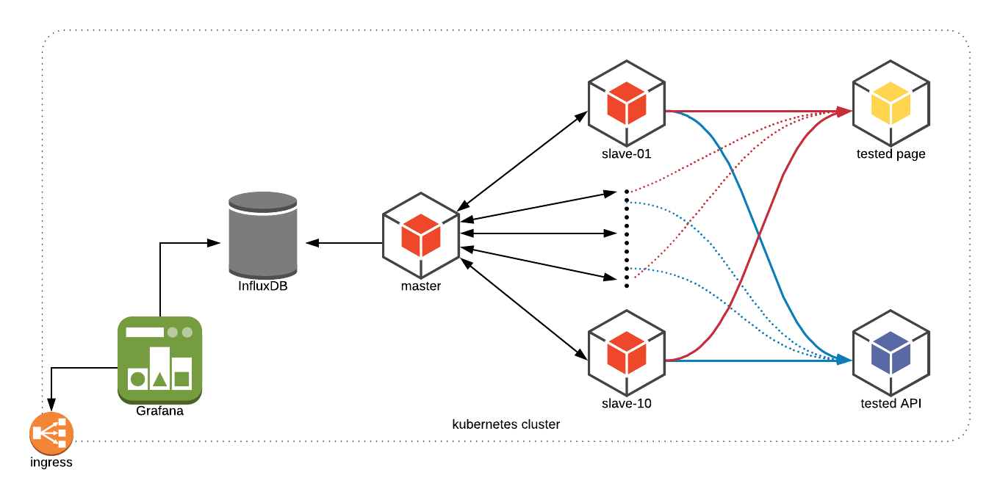

[](https://opensource.org/licenses/MIT)
# kubernetes-jmeter

Jmeter test workload inside kubernetes. [Jmeter](charts/jmeter) chart bootstraps an Jmeter stack on a Kubernetes cluster using the Helm package manager.

Currently [jmeter](charts/jmeter) helm chart deploy:
*   Jmeter master
*   Jmeter slaves
*   InfluxDB instance with graphite interface as a jmeter backend
*   Grafana instance



## Installation
```
git clone git@github.com:kaarolch/kubernetes-jmeter.git
cd kubernetes-jmeter/charts/jmeter
helm install -n test ./
```
If you would like to provide custom values.yaml you can add `-f` flag.

```
helm install -n test ./ -f my_values.yaml
```

The command deploys Jmeter on the Kubernetes cluster in the default configuration. The [configuration](#configuration) section lists the parameters that can be configured during installation.

> **Tip**: List all releases using `helm list`

If you change deployment name (`-n test`) please update grafana datasource influx `url` inside your custom values.yaml files.

If you already own grafan and influx stack, kuberentes-jmeter could be deployed without those two dependencies.

```
helm install -n test ./ --set grafana.enabled=false,influxdb.enabled=false
```

## Run sample test

### Manual run
Copy example test

```
kubectl cp examples/simple_test.jmx $(kubectl get pod -l "app=jmeter-master" -o jsonpath='{.items[0].metadata.name}'):/test/

```
Run tests

```
kubectl exec  -it $(kubectl get pod -l "app=jmeter-master" -o jsonpath='{.items[0].metadata.name}') -- sh -c 'ONE_SHOT=true; /run-test.sh'
```

### Run test via configmap

Upload test as configmap:

```
kubectl create configmap one-test --from-file=./examples/simple_test.jmx
```

Deploy test with auto run, if the `config.master.oneShotTest` would be skipped the test need to be trigger as in manual run step.

```
cd ./charts/jmeter
helm install -n test ./ --set config.master.testsConfigMap=one-test,config.master.oneShotTest=true
```
Logs could be displayed via `kubectl logs` or visualize via grafana:
```
kubectl logs $(kubectl get pod -l "app=jmeter-master" -o jsonpath='{.items[0].metadata.name}')
```
Example logs from master:
```
Sep 20, 2018 8:40:46 PM java.util.prefs.FileSystemPreferences$1 run
INFO: Created user preferences directory.
Creating summariser <summary>
Created the tree successfully using /test/simple_test.jmx
Configuring remote engine: 172.17.0.10
Configuring remote engine: 172.17.0.9
Starting remote engines
Starting the test @ Thu Sep 20 20:40:47 GMT 2018 (1537476047110)
Remote engines have been started
Waiting for possible Shutdown/StopTestNow/Heapdump message on port 4445
summary +   1003 in 00:00:13 =   76.8/s Avg:   148 Min:   123 Max:   396 Err:     0 (0.00%) Active: 16 Started: 16 Finished: 0
summary +    597 in 00:00:05 =  110.8/s Avg:   150 Min:   123 Max:   395 Err:     0 (0.00%) Active: 0 Started: 16 Finished: 16
summary =   1600 in 00:00:18 =   86.7/s Avg:   149 Min:   123 Max:   396 Err:     0 (0.00%)
Tidying up remote @ Thu Sep 20 20:41:06 GMT 2018 (1537476066203)
... end of run
```
Test could be restarted via pod restart:
```
kubectl delete pods $(kubectl get pod -l "app=jmeter-master" -o jsonpath='{.items[0].metadata.name}')
```

## Remove stack

```
helm delete YOUR_RELEASE_NAME --purge
```

The command removes all the Kubernetes components associated with the chart and deletes the release.

## Configuration

The default configuration values for this chart are listed in [values.yaml](charts/jmeter/values.yaml).

| Parameter                       | Description                                   | Default                  |
|---------------------------------|-----------------------------------------------|--------------------------|
| `imageCredentials.registry`     | Image repository                              | `docker.com`             |
| `imageCredentials.username`     | Repository user                               | -                        |
| `imageCredentials.password`     | Repository password                           | -                        |
| `image.master.repository`       | Image master repository                       | `kaarol/jmeter-master`   |
| `image.master.tag`              | Image master tag.                             | `test`                   |
| `image.master.pullPolicy`       | Image master pull policy                      | `Always`                 |
| `image.slave.repository`        | Image master repository                       | `kaarol/jmeter-slave`    |
| `image.slave.tag`               | Image master tag.                             | `latest`                 |
| `image.slave.pullPolicy`        | Image master pull policy                      | `Always`                 |
| `config.disableSSL`             | Disable SSL communication between node        | `true`                   |
| `config.master.replicaCount`    | Number of master                              | `1` - currently only one |
| `config.master.restartPolicy`   | Pod restart policy                            | `Always`                 |
| `config.master.oneShotTest`     | Run test after successful deployment          | `flase`                  |
| `image.slave.replicaCount`      | Number of jmeter workers                      | `2`                      |
| `image.slave.restartPolicy`     | Pod restart policy                            | `Always`                 |
| `anotations`                    | Additional annotations                        | `{}`                     |
| `labels`                        | Additional labels                             | `{}`                     |

### Grafana tips
File [grafana.md](docs/grafana.md) would cover all extra tips for config/access grafana charts.

## Project status

Currently kubernetes-jmeter project is able to run some test on distributed slaves but there still is a lot to do. In few days there should be some documentation added to this repo.

## To Do
Everything ;)
1.  Visualization stack (Grafana + influxdb)
*   Add default dashboard after deployment
2.  Helm charts - 80% of base chart
*   (Hold) Auto update influxdb datasource base on release name currently there is fixed test-influx host added.
*   Resource limitation
3.  Jmeter test get from maven (0%)
4.  Jmeter test get from git (20%) - still not push to master
5.  SSL between Jmeter nodes
6.  Documentation (55%)
7.  Release of a helm charts and helm repo update process via travis
